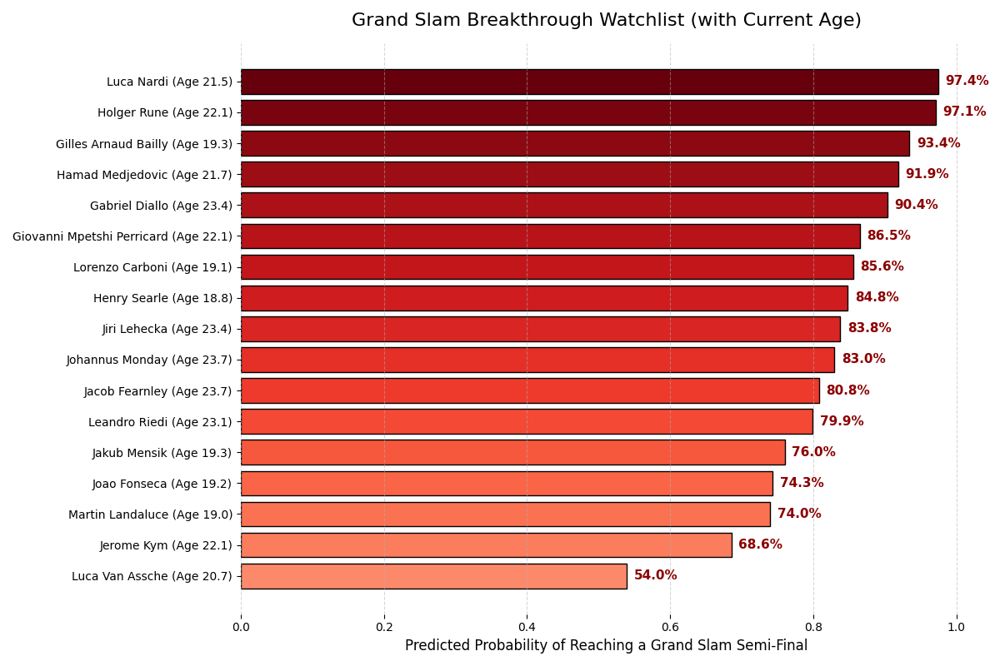

# NextGen Tennis Prediction 🎾

This project aims to identify promising young tennis players based on their early-career performance in ATP Challenger tournaments and predict whether they are likely to reach a Grand Slam semi-final in the future.

---

## Objective

Build a supervised machine learning pipeline that uses Challenger-level match data (under age 25) to model long-term player potential, specifically whether a player will reach the semi-final stage of a Grand Slam.

---

## 🏆 Why Challenger Tournaments?

The ATP Challenger Tour is the primary launchpad for young professional tennis players. Most top players begin their careers in Challenger events before breaking into ATP Tour and Grand Slam levels.  
By focusing on matches played before age 25, we aim to capture performance signals **early in a player's career**, when predictions are most impactful.

---

## What done so far?

### Data Pipeline

- **Data Collection**: Used ATP match datasets (1998–2025) including player metadata.
- **Cleaning**: Removed matches with missing serve stats, standardized formats using `pandas`.
- **Filtering**: Focused only on Challenger-level matches involving players age ≤ 24.

### Feature Engineering

For each player:
- Average serve statistics during wins and losses
- First and second serve effectiveness
- Break point save percentages
- Entry age into Challenger matches
- Average opponent rank in wins and losses
- Dominant hand and height (from ATP player file)

**Feature Selection Philosophy**  
All features were carefully selected to reflect *only what would be known at the time of the match*, in order to avoid **data leakage**.  
No retrospective performance or future outcomes were used during feature construction or labeling.  
This ensures that the model simulates real-world decision-making based on available data at the moment.

### Labeling

- Players who reached at least **one Grand Slam semi-final** during their career were labeled as `1`.
- A control group of similar-aged players who never reached that stage were labeled as `0`.

### Modeling

- Applied `SMOTE` to balance the dataset (label 1 was underrepresented).
- Trained and compared multiple classifiers:
  - Logistic Regression
  - Random Forest (with GridSearchCV tuning)
  - XGBoost (best performance overall)

---
## ✅ Model Validation

To address class imbalance and avoid overfitting, we used:

- Stratified train-test splits to preserve label distribution.
- SMOTE applied **only within training folds** using `Pipeline`, to prevent data leakage.
- GridSearchCV with 5-fold cross-validation for robust hyperparameter tuning.
- Final evaluation on an untouched test set.

Despite strong ROC AUC (~0.92), **F1-scores were more modest** due to real-world imbalance.  
This highlights the complexity of predicting rare success (e.g., Grand Slam semi-finalists) and the importance of careful validation beyond accuracy alone.

## Key Insights
-Features such as Avg Opponent Rank in Wins, Height, and 2nd Serve Performance in Losses showed the strongest association with long-term success (i.e., reaching a Grand Slam semi-final).

-XGBoost delivered the best performance in terms of ROC AUC (~0.92), indicating strong ability to rank players by potential.

-However, F1 scores were notably lower and more variable, reflecting the real-world challenge of modeling such an imbalanced and high-variance outcome.

-Logistic Regression provided interpretable results and served as a reliable baseline, though with lower overall predictive power.

-Random Forest underperformed slightly, potentially due to overfitting on the limited training data — future work may involve stronger regularization or feature selection.

-Overall, the validation process highlighted that accuracy alone is insufficient in imbalanced settings, and that precision–recall trade-offs must be carefully considered.

 _Note: Correlation does not imply causation. These features are statistically associated with higher future performance but should be investigated further before drawing definitive conclusions._

---

##  Notebooks

All steps — from cleaning to modeling — are documented in modular Jupyter notebooks in the [`colab_notebooks/`](colab_notebooks/) directory.  
Each notebook includes inline comments and visualizations to support reproducibility.

---
##  Real-World Validation – Mid-2025 Update
To test the model’s relevance, we applied it to Challenger-level performance data of young players up to 2025. The model predicted the top 16 most promising players likely to reach a Grand Slam semi-final, based solely on their early-career statistics.

## 5 of the ATP’s top 9 players under 21 (2025) were predicted by the model.
This provides a strong early signal that the model aligns with real-world talent emergence — and isn't just noise.

The full prediction ranking reflects a range of ages and profiles  from already-known names like Holger Rune and Giovanni Mpetshi Perricard to newer faces like Lorenzo Carboni and Martin Landaluce.

 These results support the model’s capacity to detect talent early based on performance trends — before they make headlines.
 ## The model results:

 ## So… Who Will Actually Make It?
Only time will tell which of these players will convert potential into Grand Slam glory.
But thanks to this model, we now have a data-driven shortlist of names worth watching as tennis’ next generation unfolds.

##  Tech Stack
Python · pandas · NumPy · scikit-learn · imbalanced-learn · XGBoost · Matplotlib · Seaborn
Google Colab  · Git · GitHub
---

##  Disclaimer

This project is intended for exploratory and educational purposes.  
While it leverages real tennis data, predictions should not be treated as definitive player evaluations.
